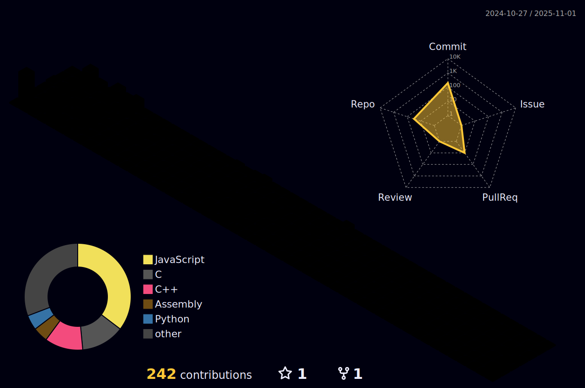

<h1 align="center"></h1>

&nbsp;
 

<h3>『Just Code 'n' Roll』</h3>

    

    <h3>***👤 My info***</h3>
    

- ⚡ My full name: **Nguyễn Hoàng Gia Bảo** 
- 📚 I'm student at **<a href="https://hcmut.edu.vn" target="blank">Ho Chi Minh City University of Technology, HCMUT  
Vietnam National University Ho Chi Minh City, VNU-HCM</a>** 
- 👨🏻‍💻 I'm currently learning **Web Development**  
- 👮 I'm looking forward to learning **Cybersecurity**  
    

    <h3>***📞 Connect with me via***</h3>
    

      
            
    
    

    
<h2>***🏆Github Trophies*** (Expand to View)</h2>

     

    
<h2>***⚙ Languages, Libraries and Tools*** (Expand to View)</h2>

         
         
        

    
<h2>***📊 Github Stats*** (Expand to View)</h2>

    

     

  
<b>⌨  My Top Languages</b>

   

&nbsp; 

 

  
<b>💻 GitHub Profile Stats</b>

   

        
         

  

  
<b>📈 My Contributions</b>

   

&nbsp;

&nbsp;

 

